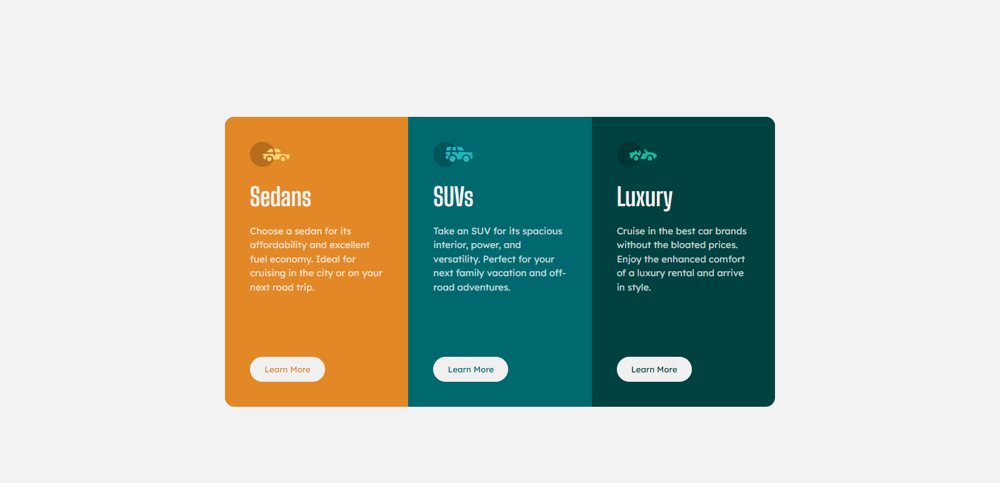
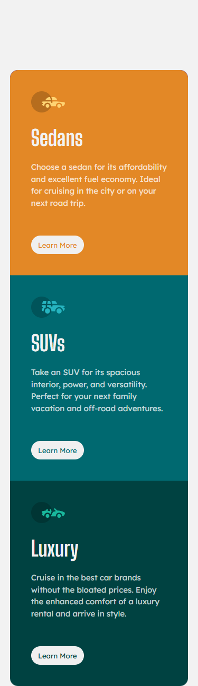

# Frontend Mentor - 3-column preview card component solution

This is a solution to the [3-column preview card component challenge on Frontend Mentor](https://www.frontendmentor.io/challenges/3column-preview-card-component-pH92eAR2-). Frontend Mentor challenges help you improve your coding skills by building realistic projects. 

## Table of contents

- [Overview](#overview)
  - [The challenge](#the-challenge)
  - [Screenshot](#screenshot)
  - [Links](#links)
- [My process](#my-process)
  - [Built with](#built-with)
  - [What I learned](#what-i-learned)
  - [Continued development](#continued-development)
  - [Useful resources](#useful-resources)
- [Author](#author)
- [Acknowledgments](#acknowledgments)

**Note: Delete this note and update the table of contents based on what sections you keep.**

## Overview

### The challenge

### Screenshot

### Links

- Solution URL: [Add solution URL here](https://github.com/Ayesh-07/Frontend-Projects/tree/main/3-column-preview-card)
- Live Site URL: [Add live site URL here](https://frontend-projects-w7tq.vercel.app/)

## My process

### Built with

- Semantic HTML5 markup
- CSS custom properties
- Flexbox
- CSS Grid
- Mobile-first workflow

## Author

- Name -  Ayesha Nudrat
- Frontend Mentor - [@Ayesh-07](https://www.frontendmentor.io/profile/Ayesh-07)
- LinkdIn - [Ayesha Nudrat](www.linkedin.com/in/ayesha-nudrat)

## Acknowledgments

Thanks to the Frontend Mentor community for providing feedback and resources.
