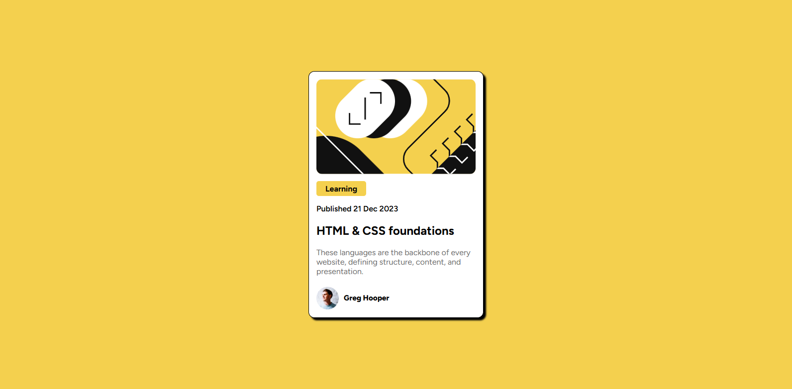
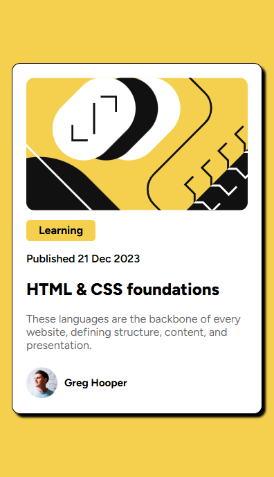

# Frontend Mentor - Blog preview card solution

This is a solution to the [Blog preview card challenge on Frontend Mentor](https://www.frontendmentor.io/challenges/blog-preview-card-ckPaj01IcS). Frontend Mentor challenges help you improve your coding skills by building realistic projects. 

## Table of contents

- [Overview](#overview)
  - [The challenge](#the-challenge)
  - [Screenshot](#screenshot)
  - [Links](#links)
- [My process](#my-process)
  - [Built with](#built-with)
  - [What I learned](#what-i-learned)
  - [Continued development](#continued-development)
  - [Useful resources](#useful-resources)
- [Author](#author)
- [Acknowledgments](#acknowledgments)

### Screenshot

### Links

- Solution URL: [Add solution URL here](https://github.com/Ayesh-07/Frontend-Projects/tree/main/blog-preview)
- Live Site URL: [Add live site URL here](https://frontend-projects-5rpk.vercel.app/)

### Useful resources

-   [MDN Web Docs - CSS Grid](https://developer.mozilla.org/en-US/docs/Web/CSS/CSS_Grid_Layout) - This helped me understand the fundamentals of CSS Grid.
-   [CSS Tricks - Flexbox Guide](https://css-tricks.com/snippets/css/a-guide-to-flexbox/) - A great resource for Flexbox concepts.

## Author

- Frontend Mentor - [@AyeshaNudrat](https://www.frontendmentor.io/profile/Ayesh-07)
- LinkdIn - [@AyeshaNudrat](https://www.linkedin.com/in/ayesha-nudrat/)

## Acknowledgments

I'd like to acknowledge the Frontend Mentor community for their helpful feedback and the challenge creators for providing a valuable learning opportunity.
