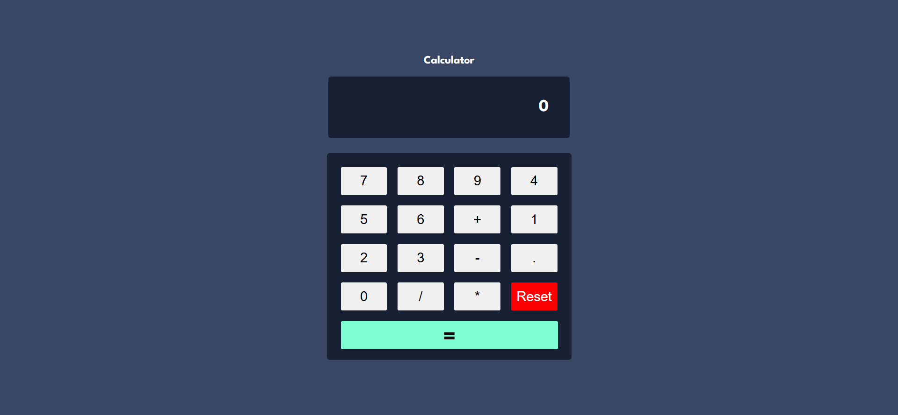

## Overview

- What is a Calculator? 
A calculator helps us do math like: 
● Add (+) 
● Subtract (-) 
● Multiply (*) 
● Divide (/) 
We want to make this using JavaScript, so users can click buttons (like numbers and 
operators), and we show the result on the screen.

### Screenshot

### Links

- Solution URL: [https://github.com/Ayesh-07/Frontend-Projects/tree/main/stats-preview-card]
- Live Site URL: [https://frontend-projects-k6xe.vercel.app/]

## Process
- Calculatorʼs Working Like a Human Brain 
Think of the calculator like this: 
1. Waiting for first number 
2. Got first number → waiting for operator 
3. Got operator → waiting for second number 
4. Got second number → waiting for = 
5. Got = → shows result 
6. User clicks again → repeat from start
