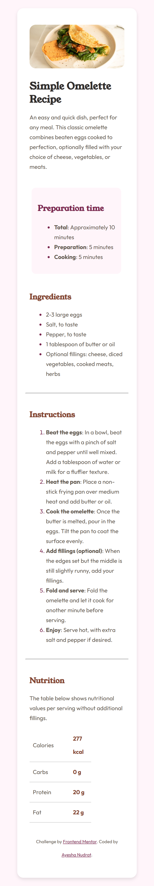

# Frontend Mentor - Recipe page solution

This is a solution to the [Recipe page challenge on Frontend Mentor](https://www.frontendmentor.io/challenges/recipe-page-KiTsR8QQKm). Frontend Mentor challenges help you improve your coding skills by building realistic projects. 


## Table of contents

- Overview

- The Challenge

- Screenshot

- Links

- My Process

- Built With

- What I Learned

- Continued Development

- Useful Resources

- Author

- Acknowledgments


## Overview

# The Challenge

Build a responsive and visually appealing recipe page that includes an image, recipe details, ingredients, and instructions. The goal is to practice semantic HTML and responsive CSS design.

### Screenshot





### Links

- Solution URL: [https://github.com/Ayesh-07/Frontend-Projects/tree/main/recipe-page-main] 
- Live Site URL: [Add live site URL here](https://your-live-site-url.com)

## My process

### Built with

- Semantic HTML5 markup
- CSS custom properties
- Flexbox
- Mobile-first workflow


### What I learned

This project helped me enhance my understanding of semantic HTML and responsive design. I practiced using Flexbox for layout and improved my styling techniques.

```html
<section class="ingredients">
  <h2>Ingredients</h2>
  <ul>
    <li>1 cup of flour</li>
    <li>2 eggs</li>
    <li>1/2 cup of sugar</li>
  </ul>
</section>
```
```css
.ingredients ul {
  list-style-type: square;
  margin-left: 20px;
}
```


### Continued development
In future projects, I want to focus more on accessibility and interactive design. Implementing ARIA roles and ensuring better keyboard navigation are key areas for improvement.

### Useful resources

MDN Web Docs - For understanding semantic HTML and CSS properties.

CSS Tricks - Great resource for learning Flexbox and Grid.

## Author

- Name -  Ayesha Nudrat
- Frontend Mentor - [@Ayesh-07](https://www.frontendmentor.io/profile/Ayesh-07)
- LinkdIn - [Ayesha Nudrat](www.linkedin.com/in/ayesha-nudrat)


## Acknowledgments

Thanks to the Frontend Mentor community for providing feedback and resources.
